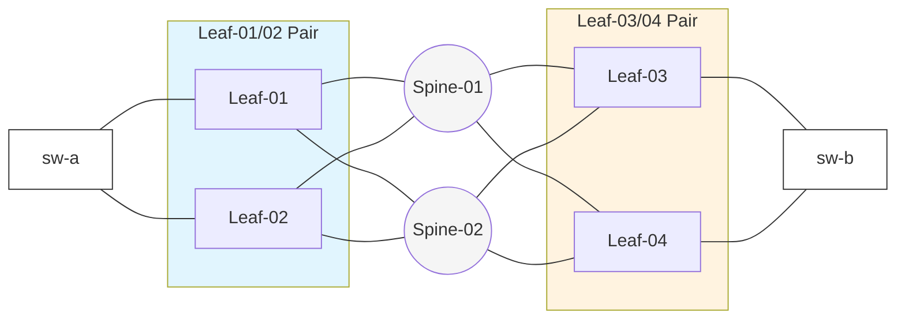

# Network Configuration: EVPN over VXLAN Identification Schema

## 0. Entities and Context
- **Entity**: VTEP (VXLAN Tunnel End Point)
- **Entity**: ESI-LAG (Multi-homing)
- **Relationship**: ESI-LAG establishes a Logical Entity across distinct VTEP IPs.
- **Dependency**: RT/VNI require global consistency across the fabric.

## 0.1 Glossary & Acronyms (略語の定義)

- **VTEP (VXLAN Tunnel End Point)**: VXLANカプセル化/カプセル化解除を行うネットワーク機器（またはインターフェース）。
- **ESI (Ethernet Segment Identifier)**: ESI-LAG等において、複数VTEPにまたがる同一のマルチホーム接続（LAG）を識別する10バイトの固有ID。
- **LAG (Link Aggregation Group)**: 複数の物理ポートを1本の論理ポートとして束ねる冗長化技術。
- **VNI (VXLAN Network Identifier)**: VXLANオーバーレイにおけるL2/L3ネットワーク識別子（24ビット）。
- **EVI (EVPN Instance)**: EVPN制御プレーン上におけるL2/L3のVPNインスタンス識別子。
- **RD (Route Distinguisher)**: BGP NLRI（ネットワーク層到達可能性情報）のプレフィックスに付与し、重複するIP空間をBGP内で一意化・識別するための8バイトの拡張属性。
- **RT (Route Target)**: EVPNルートのインポート/エクスポート制御（VPN間の通信可否）を行うBGP Controlled Extended Community属性。
- **EAD (Ethernet Auto-Discovery) Route**: EVPN Type-1ルート。ESI-LAG構成において、マルチホーミング接続の検出、エイリアシング（ロードバランシング）、および高速障害迂回（Fast Convergence）を実現するために広報されるルート。
- **BGP (Border Gateway Protocol)**: EVPNのコントロールプレーンプロトコルとして機能するパスベクタ型ルーティングプロトコル。
- **LACP (Link Aggregation Control Protocol)**: LAGの構成および状態監視を動的に行うための標準プロトコル（IEEE 802.1AX / 802.3ad）。

## 1. Executive Summary: Parameter Mapping

以下の表は、各設定項目のスコープと冗長ペアにおける扱いを整理したものです。

表中の「網内ルール」が「統一」となっているパラメータを生成・変更する場合は、全ノードで同一の値になっていることを確認する必要があります。同様に「個別」となっているパラメータを生成・変更するときは、他のノードとの重複がないことを確認する必要があります。

| 用語 | 冗長ペアでの扱い | 網内ルール | 推奨採番ルール |
| :--- | :--- | :--- | :--- |
| **VNI** | 共通 | 網内で統一 | L2の場合は `10000 + VLAN ID` L3の場合は `50000 + RDの下桁` |
| **VXLAN Source IP (VTEP IP)** | **個別 (ESI-LAG)** | 網内で重複不可 | VTEP用ループバックアドレス (`/32`) |
| **EVI** | 共通 | 網内で統一 | VNIと同一値 |
| **ESI** | 共通 | 網内で重複不可 | `00:00:5e:xx:xx:xx:xx:xx:xx:xx` (10 Bytes) |
| **LACP System ID / Priority** | 共通 | 網内で重複不可 | `0000.5e00.01xx` |
| **RD** | 個別 | 網内で重複不可 | `[Loopback0 IP]:[EVI]` または `auto` |
| **RT** | 共通 | 網内で統一 | `[AS番号]:[VNI]` または `auto` |
| **Loopback0 (管理/BGP用)** | 個別 | 網内で重複不可 | 管理用サブネットから払い出し (`/32`) |
| **Loopback1 (VTEP IP用)** | 個別 | 網内で重複不可 | VTEP用サブネットから払い出し (`/32`) |

## 2. Detailed Technical Specifications

本設計はESI方式による冗長構成を想定しており、Anycast VTEP（vPC / M-LAG）方式による冗長構成時には適用できません。

### 2.1 Hierarchy of Loopbacks
各リーフ装置は以下のループバックインターフェースを保持します。

- **Loopback 0 (Management / BGP)**
  - Scope: 網内で重複不可
  - Redundancy: 装置ごとに個別のIPを割り当てる。
  - Purpose: 装置識別、管理用アクセス、およびBGP制御プレーンセッション用。

- **Loopback 1 (VTEP IP)**
  - Scope: 網内で重複不可
  - Redundancy: ESI-LAG方式では冗長ペアであっても別のものを設定する。
  - Purpose: VTEP IPは装置ごとに個別のIPを割り当て、EVPN Type-1ルート（EAD）によってマルチホーミング制御を行う。

### 2.2 Layer 2/3 Segmentation
- **VNI (VXLAN Network Identifier)**
  - Scope: 網内で統一
  - Redundancy: 冗長ペア間で共通
  - Purpose: VXLANレイヤーにおけるL2セグメントまたはL3 VRFの識別。

- **EVI (EVPN Instance)**
  - Scope: 網内で統一
  - Redundancy: 冗長ペア間で共通
  - Purpose: EVPNコントロールプレーンにおけるL2インスタンスの識別。

### 2.3 Control Plane & Connectivity
- **ESI (Ethernet Segment Identifier)**
  - Scope: 網内で重複不可
  - Redundancy: 冗長ペア間で共通
  - Purpose: マルチホーム接続の論理識別。

- **LACP System ID / Priority**
  - Scope: 網内で重複不可
  - Redundancy: 冗長ペア間で共通
  - Purpose: LACPプロトコルにおけるLAG識別用MACアドレス。

- **RD (Route Distinguisher)**
  - Scope: 網内で重複不可
  - Redundancy: ESI-LAG方式では冗長ペアであっても別のものを設定する。
  - Purpose: VPN経路の識別子

- **RT (Route Target)**
  - Scope: 網内で統一
  - Redundancy: 冗長ペア間で共通。同じVPNを組む装置で共通の値を設定する。
  - Purpose: 経路のインポート/エクスポート制御用ラベル。

## 3. Design Example
Leaf-01 と Leaf-02 を冗長ペア、Leaf-03 と Leaf-04 を冗長ペアとして、EVPN VXLANを構成したときのパラメータの設計例です。

### 3.1 Physical Topology (Mermaid)

### 3.2 Configuration Values

| 項目 | 冗長ペア A (Leaf-01/02) | 冗長ペア B (Leaf-03/04) | 網内共通/備考 |
| :--- | :--- | :--- | :--- |
| **ESI** | 00:00:5e:00:01:00:00:00:00:01 | 00:00:5e:00:01:00:00:00:00:02 | ペア毎に一意 |
| **VNI (L2)** | 10100 | 10100 | **全装置で同一** |
| **RD** | 10.0.0.254:10100 | 10.0.0.253:10100 | IPベースで自動的に一意 |
| **RT** | 65001:10100 | 65001:10100 | **全装置で同一** |
