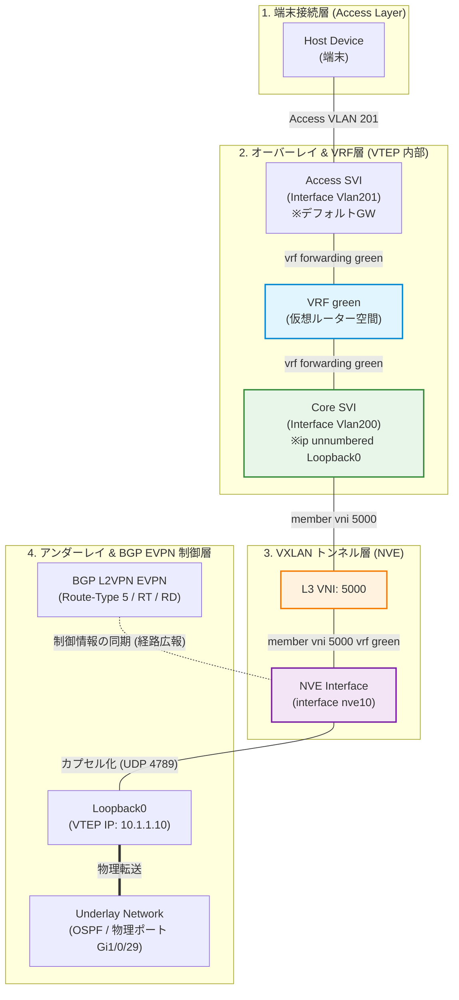

# EVPN VXLAN Layer 3 Overlay Network

## EVPN VXLAN Layer 3オーバーレイネットワークとは
EVPN VXLANのLayer 3オーバーレイネットワークを使えば、異なるLayer 2ネットワーク（異なるサブネット）にいるホスト同士でも、Layer 3のルーティング（通信）が可能になります。このとき、ネットワークは「Layer 3 VNI」と「IP VRF」という仕組みを使って、パケットのルーティングを制御します。

本書ではLayer 3オーバーレイネットワークの設定方法を説明しています。Layer 2とLayer 3のネットワークを組み合わせてルーティングとブリッジングの両方を一つのデバイスで行う「IRB（Integrated Routing and Bridging）」については別の資料を参照してください。

## 交換される経路

### 1. Route Type 5 (IP Prefix Route) - 【主役】
L3オーバーレイの要となるのがこのタイプの経路です。

- 何を伝えるか: サブネット全体（IPプレフィックス）の情報
  - 例：「ネットワーク 10.1.10.0/24 に到達したければ、私のVTEPに送ってくれ」
  - この時、そのサブネットがどの L3 VNI に属しているかという情報も一緒に伝えます。

- 役割: 異なるサブネット間でのルーティングを可能にします。物理ルーターが持つ「ルーティングテーブル」の内容をBGPで全スイッチに配布しているイメージです。

### 2. Route Type 2 (MAC/IP Advertisement Route) - 【IP情報の解決】
L3オーバーレイにおいて、このルートタイプは「個別のホストのIP」を伝えるために使われます。

- 何を伝えるか:
  - 特定のIPアドレス（例: 10.1.10.5/32）
  - そのIPに紐づくMACアドレス
  - そのホストがいるVTEPのIP
- 役割:
  - 「ARP抑制」のために使われます。通信相手のIPアドレスがどのMACアドレス（どのVTEP）にいるかを事前に知っておくことで、無駄なARPブロードキャストを排除します。
  - L3ルーティングの際、宛先IPへの「ラストワンマイル（最後のスイッチからホストへの配送）」を正確に行うために必要です。

## 内部コンポーネントとその接続

* VRF（Virtual Routing and Forwarding）
    * スイッチ内部で独立したルーティングテーブル（ルーティング空間）を保持する仮想ルーターです。テナント（顧客・部門）ごとのL3通信を分離するために使用します

* L3 VNI（Layer 3 VXLAN Network Identifier）
    * トンネル（VXLANヘッダー）内で「どの VRF の通信か」を識別するためのグローバルなID番号（例: 50000番台）です。対向の VTEP へ VRF 空間を伝達します

* Core SVI（L3 VNI用 VLAN / SVI）
    * スイッチ内部では VRF と L3 VNI をVLANで直結します
    * VRFはルータなので、SVIインターフェースで接続します
    * 端末のGWとしては機能せず、ip unnumbered Loopback1 や no autostate を設定して L3 VNI 処理専用として動作させます

* Access SVI（Tenant SVI）
    * 端末（ホスト）が接続するVLAN上のSVIです（例: Interface Vlan201）
    * 端末（ホスト）から見るとこれがデフォルトゲートウェイになります
    * VRF に所属させます

* NVE Interface (interface nve)
    * VXLANのトンネルを制御する仮想インターフェースです。どの VNI（L2/L3）をそのトンネル上で有効化するかを定義します。

これらコンポーネントの接続を図示するとこのようになります。

```
[ 端末 (Host) ]
      │ (Access VLAN)
[ Access SVI ] ─── (所属) ───┐
                            ▼
                     [ VRF (仮想ルーター) ]
                            ▲
[ Core SVI (Vlan200) ] ─────┤ (結びつけ)
   └── (紐づけ) ─── [ L3 VNI ]
                       │
             [ NVE トンネル ] ──(BGP EVPN / Type-5 Route)──> 対向VTEPへ
```




## VTEP での IP VRF の設定
VTEP で IP VRF を設定するには、次の手順を実行します。

### Step 1
```
enable
```

#### Example
```
Device> enable
```

#### Purpose
Enables privileged EXEC mode. Enter your password, if prompted.

### Step 2
```
configure terminal
```

#### Example
```
Device# configure terminal
```

#### Purpose
Enters global configuration mode.

### Step 3
```
vrf definition vrf-name
```

#### Example
```
Device(config)# vrf definition Green
```

#### Purpose
Enters the VRF configuration mode for the specified VRF instance.

### Step 4
```
rd vpn-route-distinguisher
```

#### Example
```
Device(config-vrf)# rd 100:1
```

#### Purpose
Specifies the route distinguisher for the VRF instance.

### Step 5
```
address-family ipv4 [ multicast | unicast]
```

#### Example
```
Device(config-vrf)# address-family ipv4
```

#### Purpose
Enters the IPv4 address family configuration mode.

### Step 6
```
route-target { export | import | both} route-target-ext-community
```

#### Example
```
Device(config-vrf-af)# route-target export 100:1
```

#### Example
```
Device(config-vrf-af)# route-target import 100:1
```

#### Purpose
Creates a list of import, export, or both import and export route target communities for the specified VRF.

Enter either an autonomous system number and an arbitrary number (xxx:y), or an IP address and an arbitrary number (A.B.C.D:y).

#### Step 7
```
route-target { export | import | both} route-target-ext-community stitching
```

#### Example
```
Device(config-vrf-af)# route-target export 100:1 stitching
```

#### Example
```
Device(config-vrf-af)# route-target import 100:1 stitching
```

#### Purpose
Configures importing, exporting, or both importing and exporting of EVPN route target communities for the VRF.

### Step 8
```
exit-address-family
```

#### Example
```
Device(config-vrf-af)# exit-address-family
```

#### Purpose
Exits VRF address family configuration mode and enters VRF configuration mode.

### Step 9
```
address-family ipv6 [ multicast | unicast]
```

#### Example
```
Device(config-vrf)# address-family ipv6
```

#### Purpose
Enters the IPv6 address family configuration mode.

### Step 10
```
route-target { export | import | both} route-target-ext-community
```

#### Example
```
Device(config-vrf-af)# route-target export 100:1
```

#### Example
```
Device(config-vrf-af)# route-target import 100:1
```

#### Purpose
Creates a list of import, export, or both import and export route target communities for the specified VRF.

Enter either an autonomous system number and an arbitrary number (xxx:y), or an IP address and an arbitrary number (A.B.C.D:y).

### Step 11
```
route-target { export | import | both} route-target-ext-community stitching
```

#### Example
```
Device(config-vrf-af)# route-target export 100:1 stitching
```

#### Purpose
Configures importing, exporting, or both importing and exporting of VXLAN route target communities for the VRF.

### Step 12
```
exit-address-family
```

#### Example
```
Device(config-vrf-af)# exit-address-family
```

#### Purpose
Exits VRF address family configuration mode and enters VRF configuration mode.

### Step 13
```
end
```

#### Example
```
Device(config-vrf)# end
```

#### Purpose
Returns to privileged EXEC mode

## VTEP でのコア側 VLAN の設定
VTEP でコア側 VLAN を設定するには、次の手順を実行します。

### Step 1
```
enable
```

#### Example
```
Device> enable
```

#### Purpose
Enables privileged EXEC mode. Enter your password, if prompted.

### Step 2
```
configure terminal
```

#### Example
```
Device# configure terminal
```

#### Purpose
Enters global configuration mode.

### Step 3
```
vlan configuration vlan-id
```

#### Example
```
Device(config)# vlan configuration 11
```

#### Purpose
Enters VLAN feature configuration mode for the specified VLAN interface.

### Step 4
```
member vni l3-vni-number
```

#### Example
```
Device(config-vlan)# member vni 5000
```

#### Purpose
Adds EVPN instance as a member of the VLAN configuration. The VNI here is used as a Layer 3 VNI.

### Step 5
```
end
```

#### Example
```
Device(config-vlan)# end
```

#### Purpose
Returns to privileged EXEC mode


## Configuring Access-facing VLAN on a VTEP
To configure the access-facing VLAN on a VTEP, perform the following steps:

### Step 1
```
enable
```

#### Example
```
Device> enable
```

#### Purpose
Enables privileged EXEC mode. Enter your password, if prompted.

### Step 2
```
configure terminal
```

#### Example
```
Device# configure terminal
```

#### Purpose
Enters global configuration mode.

### Step 3
```
interface interface-name
``

#### Example
```
Device(config)# interface GigabitEthernet1/0/1
```

#### Purpose
Enters interface configuration mode for the specified interface.

### Step 4
```
switchport access vlan vlan-id
```

#### Example
```
Device(config-if)# switchport access vlan 40
```

#### Purpose
Configures the interface as a static-access port of the specified VLAN. Interface can also be configured as a trunk interface, if required.

### Step 5
```
end
```

#### Example
```
Device(config-if)# end
```

#### Purpose
Returns to privileged EXEC mode.


## Configuring the Switch Virtual Interface for the Access-facing VLANs
To configure the SVI for the access-facing VLAN on a VTEP, perform the following steps:

### Step 1
```
enable
```

#### Example
```
Device> enable
```

#### Purpose
Enables privileged EXEC mode. Enter your password, if prompted.

### Step 2
```
configure terminal
```

#### Example
```
Device# configure terminal
```

#### Purpose
Enters global configuration mode.

### Step 3
```
interface vlan vlan-id
```

#### Example
```
Device(config)# interface vlan 40
```

#### Purpose
Enters interface configuration mode for the specified VLAN.

### Step 4
```
vrf forwarding vrf-name
```

#### Example
```
Device(config-if)# vrf forwarding Green
```

#### Purpose
Configures the SVI for the VLAN.

### Step 5
```
ip address ip-address
```

#### Example
```
Device(config-if)# ip address 192.168.10.100 255.255.255.0
```

#### Purpose
Configures the IP address of the SVI.

### Step 6
```
mac-address mac-address-value
```

#### Example
```
Device(config-if)# mac-address aabb.cc01.f100
```

#### Porpose
(Optional) Manually sets the MAC address for the VLAN interface.

### Step 7
```
exit
```

#### Example
```
Device(config-if)# exit
```

#### Purpose
Returns to global configuration mode.

### Step 8
```
end
```

#### Example
```
Device(config-if)# end
```

#### Purpose
Returns to privileged EXEC mode.


## Configuring the Loopback Interface on a VTEP
To configure the loopback interface on a VTEP, perform the following steps:

### Step 1
```
enable
```

#### Example
```
Device> enable
```

#### Purpose
Enables privileged EXEC mode. Enter your password, if prompted.

### Step 2
```
configure terminal
```

#### Example
```
Device# configure terminal
```

#### Purpose
Enters global configuration mode.

### Step 3
```
interface loopback-interface-id
```

#### Example
```
Device(config)# interface Loopback0
```

#### Purpose
Enters interface configuration mode for the specified Loopback interface.

### Step 4
```
ip address ipv4-address
```

#### Example
```
Device(config-if)# ip address 10.12.11.11 255.255.255.255
```

#### Purpose
Configures the IP address for the Loopback interface.

### Step 5
```
ip pim sparse mode
```

#### Example
```
Device(config-if)# ip pim sparse mode
```

#### Purpose
(Optional) Enables Protocol Independent Multicast (PIM) sparse mode on the Loopback interface.

Note: Enable PIM sparse mode only if EVPN VXLAN Layer 2 overlay network is also configured on the VTEP with underlay multicast as the mechanism for forwarding BUM traffic.

### Step 6
```
end
```

#### Example
```
Device(config-vlan)# end
```

#### Purpose
Returns to privileged EXEC mode.

## Configuring the NVE Interface on a VTEP
To add a Layer 3 VNI member to the NVE interface on a VTEP, perform the following steps:

### Step 1
```
enable
```

#### Example
```
Device> enable
```

#### Purpose
Enables privileged EXEC mode. Enter your password, if prompted.

### Step 2
```
configure terminal
```

#### Example
```
Device# configure terminal
```

#### Purpose
Enters global configuration mode.

### Step 3
```
interface nve-interface-id
```

#### Example
```
Device(config)# interface nve1
```

#### Purpose
Defines the interface to be configured as a trunk, and enters interface configuration mode.

### Step 4
```
no ip address
```

#### Example
```
Device(config-if)# no ip address
```

#### Purpose
Disables IP processing on the interface by removing its IP address.

### Step 5
```
source-interface loopback-interface-id
```

#### Example
```
Device(config-if)# source-interface loopback0
```

#### Purpose
Sets the IP address of the specified loopback interface as the source IP address.

### Step 6
```
host-reachability protocol bgp
```

#### Example
```
Device(config-if)# host-reachability protocol bgp
```

#### Purpose
Configures BGP as the host-reachability protocol on the interface.

Note: You must configure the host reachability protocol on the interface. If you do not execute this step, the VXLAN tunnel defaults to static VXLAN tunnel, which is currently not supported on the Cisco Catalyst 9000 Series switches.

### Step 7
```
member vni vni-id vrf vrf-name
```

#### Example
```
Device(config-if)# member vni 5000 vrf Green
```

#### Purpose
Associates the Layer 3 VNI id with the NVE interface.

Note: The Layer 3 VNI id must match with the VNI id configured in the core VLAN on the VTEP.

### Step 8
```
end
```

#### Example
```
Device(config-if)# end
```

#### Purpose
Returns to privileged EXEC mode.


## Configuring BGP with IPv4 or IPv6 or Both Address Families on VTEP
To configure BGP on a VTEP with IPv4 or IPv6 or both address families and a spine switch as the neighbor, perform the following steps:

### Step 1
```
enable
```

#### Example
```
Device> enable
```

#### Purpose
Enables privileged EXEC mode. Enter your password, if prompted.

### Step 2
```
configure terminal
```

#### Example
```
Device# configure terminal
```

#### Purpose
Enters global configuration mode.

### Step 3
```
router bgp autonomous-system-number
```

#### Example
```
Device(config)# router bgp 1
```

#### Purpose
Enables a BGP routing process, assigns it an autonomous system number, and enters router configuration mode.

### Step 4
```
bgp log-neighbor-changes
```

#### Example
```
Device(config-router)# bgp log-neighbor-changes
```

#### Purpose
(Optional) Enables the generation of logging messages when the status of a BGP neighbor changes.

### Step 5
```
bgp update-delay time-period
```

#### Example
```
Device(config-router)# bgp update-delay 1
```

#### Purpose
(Optional) Sets the maximum initial delay period before sending the first update.


### Step 6
```
bgp graceful-restart
```

#### Example
```
Device(config-router)# bgp graceful-restart
```

#### Purpose
(Optional) Enables the BGP graceful restart capability for all BGP neighbors.


### Step 7
```
no bgp default ipv4-unicast
```

#### Example
```
Device(config-router)# no bgp default ipv4-unicast
```

#### Purpose
(Optional) Disables default IPv4 unicast address family for BGP peering session establishment.

### Step 8
```
neighbor ip-address remote-as number
```

#### Example
```
Device(config-router)# neighbor 10.11.11.11 remote-as 1
```

#### Purpose
Defines multiprotocol-BGP neighbors. Under each neighbor, define the configuration. Use the IP address of the spine switch as the neighbor IP address.

### Step 9
```
neighbor { ip-address | group-name} update-source interface
```

#### Example
```
Device(config-router)# neighbor 10.11.11.11 update-source Loopback0
```

#### Purpose
Configures update source. Update source can be configured per neighbor or per peer-group. Use the IP address of the spine switch as the neighbor IP address.

### Step 10
```
address-family l2vpn evpn
```

#### Example
```
Device(config-router)# address-family l2vpn evpn
```

#### Purpose
Specifies the L2VPN address family and enters address family configuration mode.

### Step 11
```
neighbor ip-address activate
```

#### Example
```
Device(config-router-af)# neighbor 10.11.11.11 activate
```

#### Purpose
Enables the exchange information from a BGP neighbor. Use the IP address of the spine switch as the neighbor IP address.

### Step 12
```
neighbor ip-address send-community [ both | extended | standard]
```

#### Example
```
Device(config-router-af)# neighbor 10.11.11.11 send-community both
```

#### Purpose
Specifies the communities attribute sent to a BGP neighbor. Use the IP address of the spine switch as the neighbor IP address.

### Step 13
```
exit-address-family
```

#### Example
```
Device(config-router-af)# exit-address-family
```

#### Purpose
Exits address family configuration mode and returns to router configuration mode.

### Step 14
```
address-family ipv4 vrf vrf-name
```

#### Example
```
Device(config-router)# address-family ipv4 vrf Green
```

#### Purpose
Specifies the IPv4 address family and enters address family configuration mode.

### Step 15
```
advertise l2vpn evpn
```

#### Example
```
Device(config-router-af)# advertise l2vpn evpn
```

#### Purpose
Advertises Layer 2 VPN EVPN routes within a tenant VRF in an EVPN VXLAN fabric.

### Step 16
```
redistribute connected
```

#### Example
```
Device(config-router-af)# redistribute connected
```

#### Purpose
(Optional) Redistributes connected routes to BGP.

### Step 17
```
redistribute static
```

#### Example
```
Device(config-router-af)# redistribute static
```

#### Purpose
(Optional) Redistributes static routes to BGP.

### Step 18
```
exit-address-family
```

#### Example
```
Device(config-router-af)# exit-address-family
```

#### Purpose
Exits address family configuration mode and returns to router configuration mode.

### Step 19
```
address-family ipv6 vrf vrf-name
```

#### Example
```
Device(config-router)# address-family ipv6 vrf green
```

#### Purpose
Specifies the IPv6 address family and enters address family configuration mode.

### Step 20
```
advertise l2vpn evpn
```

#### Example
```
Device(config-router-af)# advertise l2vpn evpn
```

#### Purpose
Advertises Layer 2 VPN EVPN routes within a tenant VRF in an EVPN VXLAN fabric.

### Step 21
```
redistribute connected
```

#### Example
```
Device(config-router-af)# redistribute connected
```

#### Purpose
(Optional) Redistributes connected routes to BGP.

### Step 22
```
redistribute static
```

#### Example
```
Device(config-router-af)# redistribute static
```

#### Purpose
(Optional) Redistributes static routes to BGP.

### Step 23
```
exit-address-family
```

#### Example
```
Device(config-router-af)# exit-address-family
```

#### Purpose
Exits address family configuration mode and returns to router configuration mode.

### Step 24
```
end
```

#### Example
```
Device(config-router)# end
```

#### Purpose
Returns to privileged EXEC mode.
